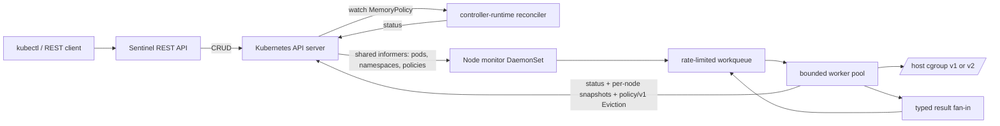

# Architecture

Sentinel separates cluster control from node-local Linux operations. The operator is an ordinary, leader-elected controller and JSON API. A DaemonSet runs one monitor on each node, consumes Kubernetes watch streams, and reads only that node's mounted cgroup filesystem.

## Design boundaries

- `api/v1` owns the Kubernetes contract. `MemoryPolicy` is cluster-scoped because a policy selects namespaces.
- `controllers` uses controller-runtime's informer-backed cache. It never loops on an API polling schedule.
- `internal/monitor` uses client-go shared informers and a typed rate-limiting workqueue. Its scan ticker re-enqueues cached pod keys; it does not list Kubernetes objects on each scan.
- `internal/workerpool` fixes concurrency and queue memory. Cancellation, timeouts, retries, and shutdown are explicit.
- Worker results from all bounded workers converge through one buffered, typed fan-in stream. The monitor uses those results as the single place that completes and rate-limits workqueue keys.
- `internal/cgroup` reads kernel values without estimation. Unlimited cgroups are intentionally skipped because no meaningful percentage exists.
- `internal/eviction` exclusively creates `policy/v1` Eviction resources. A `429 Too Many Requests` from PDB admission is retried; pods are never deleted directly.
- `internal/snapshot` stores one bounded ConfigMap per node, avoiding multi-writer objects. Each contains at most 256 current pod observations and eight policy names per observation. Deleted entries are removed promptly when observed, and the REST API filters anything older than 15 seconds.
- `web` has no external persistence adapter. Every request maps to controller-runtime CRUD over the Kubernetes API server, which remains the single persistence layer.

## Why the node data plane exists

Kubernetes reports resource configuration and aggregated metrics, but it does not expose a generic API for reading a pod's live cgroup files or signalling every process in that cgroup. The DaemonSet therefore performs those two operations locally on each node. Its pod informer is field-selected to that node, so only the owning monitor publishes the pod observation and writes the node's snapshot ConfigMap.

## Intervention retry state

The first breach creates a bounded in-memory record keyed by Pod UID and carrying a unique intervention ID. After status is recorded and SIGTERM is sent, a failed eviction moves the record to `PendingEviction`. Later scans still fetch the current policy and read current memory, but skip breach accounting, signalling, and the grace delay. Recovery, policy mismatch, pod deletion, missing cgroups, successful eviction, or cancellation clears the record. This preserves PDB retry behavior without repeating disruptive steps.

## Node security model

Signalling a process is not part of the Kubernetes API. The monitor therefore runs with `hostPID: true`, UID 0, and only `CAP_KILL`, with the host cgroup tree mounted read-only. It is not privileged, cannot write cgroup controls, has a read-only root filesystem, and uses RuntimeDefault seccomp. This is still a node-trusted workload; admission policy should restrict deployment changes to cluster administrators.

## Overlapping policies

Matching policies are sorted by name for deterministic behavior. The first breached policy performs intervention. This prevents duplicate signals and eviction requests for one pod during a scan. Operators should avoid overlapping selectors when policy priority matters.
