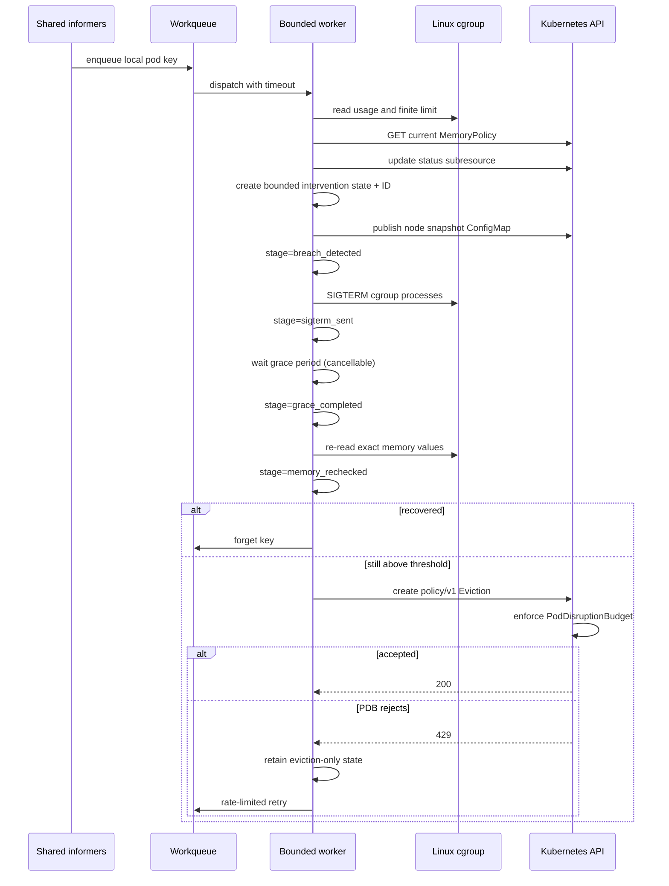

# Breach sequence

The latest policy is fetched after detecting a breach so a stale informer observation cannot apply superseded thresholds. Status updates use optimistic conflict retries. On a PDB retry, current memory and policy are evaluated again, but breach accounting, SIGTERM, and the grace wait are not repeated.
